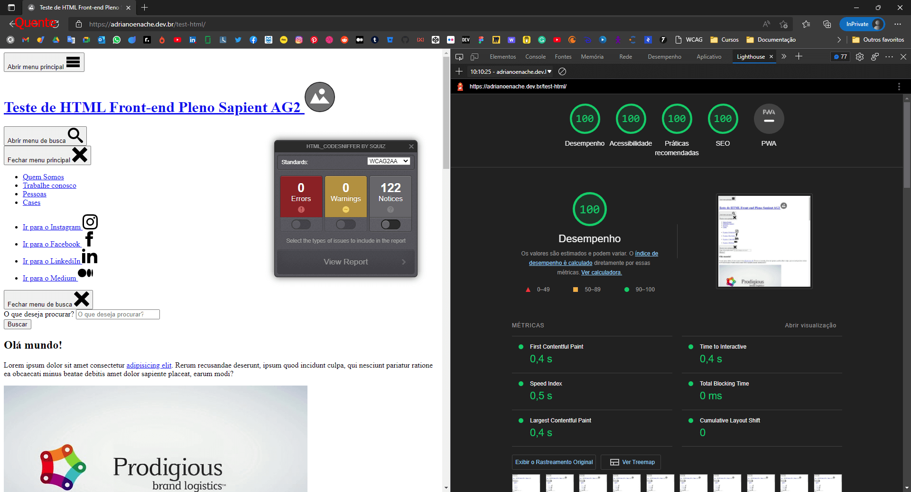

# Teste de Front-end Pleno Sapient AG2

## HTML

Para esta etapa do teste vamos avaliar a construção de um código semântico, aonde queremos entender o nível de conhecimento nas tags do HTML e organização.

Dentro da pasta **Wireframe** temos um PDF com o esqueleto de uma página, com textos de marcação aplicados além de comportamentos de alguns elementos.

A partir deste documento você irá:
 1. Criar um arquivo index.html na raiz desta pasta
 2. Estruturar o HTML **sem CSS ou JS**
 3. Aplicar as regras de acessibilidade necessárias ao documento
 4. Inserir todos os conteúdos dentro dos elementos criados
 5. Incluir as imagens de marcação fazendo referência a pasta `assets` dentro desta mesma pasta

> O arquivo final não terá nenhum estilo, será apenas um HTML corrido sem nenhuma formatação mas deverá ter todas as tags implementadas da melhor forma, estruturando a página como títulos, parágrafos, links, listas e quaisquer outros elementos que sejam indicados no wireframe.

- - -

### Teste de acessibilidade

Para ajudar o teste de acessibilidade em arquivos locais sugerimos a utilização de plugins no seu browser

* [Chrome](https://chrome.google.com/webstore/detail/axe/lhdoppojpmngadmnindnejefpokejbdd)
* [Edge](https://microsoftedge.microsoft.com/addons/detail/axe-web-accessibility-t/kcenlimkmjjkdfcaleembgmldmnnlfkn)
* [Firefox](https://addons.mozilla.org/en-us/firefox/addon/axe-devtools/)

---

## Teste WCAG2-AA e Lighthouse

A página do teste está acessível [neste link](https://adrianoenache.dev.br/test-html/).

